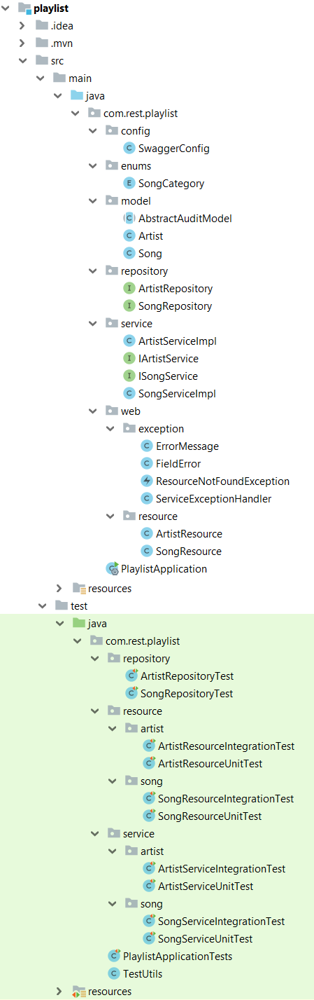
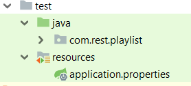

# Spring Boot Rest Api Data JPA OneToMany - Playlists
Dans ce tutoriel, nous allons écrire un service CRUD REST Spring Boot basé sur un mappage bidirectionnel pour une relation JPA et Hibernate OneToMany et entièrement couvert par des tests.

Les relations oneToMany et ManyToOne font référence à la relation entre deux tables :

* **Song** : a un identifiant, un titre, une description, une catégorie et une durée.

* **Artist** : a un nom et une popularité


Une Chanson peut être liée à un seul artiste, et une chanson est liée à plusieurs artiste.

Apis aide à créer, récupérer, mettre à jour, supprimer des Song et des artistes.

Apis prend également en charge les méthodes de recherche personnalisées (query methods) telles que la recherche par catégorie ou par le nom de l’artiste.

##### La relation OneToMany
– L’annotation **@OneToMany** définit une relation 1:n entre deux entités.

 L’annotation **@OneToMany** implique que la table song contient une colonne qui est une clé étrangère contenant la clé de playlist. 

Par défaut, JPA s’attend à ce que cette colonne se nomme playlist_id, mais il est possible de changer ce nom grâce à l’annotation @JoinColumn.

 Ainsi, **@ManyToOne** fonctionne exactement comme @OneToMany sauf que cette annotation porte sur l’autre côté de la relation.

##### Spring Boot
Spring Boot est un projet Spring qui facilite le processus de configuration et de publication des applications.

En suivant des étapes simples, vous pourrez exécuter votre premier projet.

##### API REST (Representational State Transfer Application Program Interface)
Il se base sur le protocole **HTTP** pour transférer des informations. 
Un client lance une requête HTTP, et le serveur renvoie une réponse à travers plusieurs méthodes dont les plus utilisées sont : **POST**, **GET**, **PUT** et **DELETE**.

##### Outils utilisés : 
* Java 8
* IDE Intellij IDEA
* Spring Boot 2.5.7 (avec Spring Web MVC et Spring Data JPA)
* PostgreSQL
* H2 Database
* Lombok 1.18.22
* Maven 4.0.0


## Initialisation du projet
Pour amorcer une application Spring Boot , nous pouvons démarrer le projet à partir de zéro avec notre IDE préféré, ou simplement utiliser un autre moyen qui facilite la vie : [SpringInitializr](https://start.spring.io/)

Initialement, nous avons choisi les dépendances suivantes : Spring web, Spring Data JPA, Validation, H2 Database, Lombok et PostgreSQL Driver.


## Structure du projet
L'image ci-dessous montre la structure finale du projet



* **Pom.xml**

Contient des dépendances pour Spring Boot. Dans notre cas, nous sommes besoin de ces dépendances.

```xml
	<dependencies>
    		<dependency>
    			<groupId>org.springframework.boot</groupId>
    			<artifactId>spring-boot-starter-data-jpa</artifactId>
    			<version>2.5.7</version>
    		</dependency>
    		<dependency>
    			<groupId>org.springframework.boot</groupId>
    			<artifactId>spring-boot-starter-validation</artifactId>
    		</dependency>
    		<dependency>
    			<groupId>org.springframework.boot</groupId>
    			<artifactId>spring-boot-starter-web</artifactId>
    		</dependency>
    
    		<dependency>
    			<groupId>org.postgresql</groupId>
    			<artifactId>postgresql</artifactId>
    			<scope>runtime</scope>
    			<version>42.2.24</version>
    		</dependency>
    		<dependency>
    			<groupId>org.springframework.boot</groupId>
    			<artifactId>spring-boot-starter-test</artifactId>
    			<scope>test</scope>
    		</dependency>
            <dependency>
                <groupId>io.springfox</groupId>
                <artifactId>springfox-swagger2</artifactId>
                <version>2.9.2</version>
            </dependency>
    		<dependency>
    			<groupId>io.springfox</groupId>
    			<artifactId>springfox-swagger-ui</artifactId>
    			<version>2.9.2</version>
    		</dependency>
            <dependency>
                <groupId>org.apache.commons</groupId>
                <artifactId>commons-lang3</artifactId>
                <version>3.9</version>
            </dependency>
            <dependency>
                <groupId>junit</groupId>
                <artifactId>junit</artifactId>
                <version>4.13.1</version>
                <scope>test</scope>
            </dependency>
    		<dependency>
    			<groupId>org.hibernate</groupId>
    			<artifactId>hibernate-envers</artifactId>
    			<version>5.6.1.Final</version>
    		</dependency>
    		<dependency>
    			<groupId>com.h2database</groupId>
    			<artifactId>h2</artifactId>
    			<scope>test</scope>
    		</dependency>
    		<dependency>
    			<groupId>org.projectlombok</groupId>
    			<artifactId>lombok</artifactId>
    			<version>1.18.22</version>
    		</dependency>
    	</dependencies>
```

* **Main Class**

C’est la classe principale de l’application et appelée aussi une classe de démarrage.

L ’adresse par défaut d’exécution : http://localhost:8080 

```java 
@SpringBootApplication
public class PlaylistApplication {

	public static void main(String[] args) {
		SpringApplication.run(PlaylistApplication.class, args);
	}

}
```

## I. Configuration PostgreSQL
* **application.properties**

Les propriétés **spring.datasource.username** et **spring.datasource.password** sont les mêmes que celles de votre installation de base de données.

Spring Boot utilise Hibernate pour l'implémentation JPA, nous configurons PostgreSQLDialect pour PostgreSQL 🡺 Ce dialecte nous permet de générer de meilleures requêtes SQL pour cette base de données.

**spring.jpa.hibernate.ddl-auto= update** est utilisé pour créer automatiquement les tables en fonction des classes d’entités dans l’application. Toute modification du modèle déclenche également une mise à jour de la table. 

Pour la production, cette propriété doit être **validate**, cette valeur valide le schéma en correspondance avec le mapping hibernate.


```yaml
spring.datasource.url=jdbc:postgresql://localhost:5432/playlist_song_artist_db
spring.datasource.username=playlistadmin
spring.datasource.password=admin

spring.jpa.properties.hibernate.dialect = org.hibernate.dialect.PostgreSQLDialect

spring.jpa.hibernate.ddl-auto=update
```
## II. Modèle
* **AbstractAuditModel**
Les deux modèles de l’application Playlist et Song auront des champs communs liés à l'audit tels que createdAt et updatedAt.

Il est préférable de faire abstraction de ces champs communs dans une classe de base distincte appelée AbstractAuditModel. Cette classe sera étendue par d'autres entités.

**@EntityListeners(AuditingEntityListener.class)** : les valeurs de createdAt et updatedAt seront automatiquement renseignées lorsque les entités seront conservées.

**@MappedSuperclass.java**

En utilisant la stratégie MappedSuperclass, l'héritage n'est évident que dans la classe mais pas dans le modèle d'entité. Il faut noter que cette classe n'a plus d’annotation @Entity, car elle ne sera pas conservée seule dans la base de données.

```java
@MappedSuperclass
@Audited
@EntityListeners(AuditingEntityListener.class)
public abstract class AbstractAuditModel implements Serializable {

    @CreatedDate
    @JsonIgnore
    @Column(name = "created_at", nullable = false, updatable = false)
    private Instant createAt = Instant.now();

    @LastModifiedDate
    @JsonIgnore
    @Column(name = "updated_at")
    private Instant updatedAt;

    public Instant getCreateAt() {
        return createAt;
    }

    public void setCreateAt(Instant createAt) {
        this.createAt = createAt;
    }

    public Instant getUpdatedAt() {
        return updatedAt;
    }

    public void setUpdatedAt(Instant updatedAt) {
        this.updatedAt = updatedAt;
    }
}
```
**@EnableJpaAuditing** : Pour activer l'audit JPA (dans la classe de repository)

* **Song.java**

L’entité « Song » est mappé à une table nommée « songs » dans la base de données

- l'annotation **@Entity** indique que la classe est une classe Java persistante.

– l'annotation **@Table** fournit la table qui mappe cette entité.

– l'annotation **@Id** est pour la clé primaire.

– l'annotation **@GeneratedValue** est utilisée pour définir la stratégie de génération de la clé primaire. **GenerationType.SEQUENCE** signifie la génération de la clé primaire se fera par une séquence définie dans le SGBD, auquel on ajoute l’attribut generator.

– l'annotation **@Column** est utilisée pour définir la colonne dans la base de données qui mappe le champ annoté.
  
Ici, nous allons utiliser **Lombok** : est une bibliothèque Java qui se connecte automatiquement à un éditeur afin de générer automatiquement les méthodes getter ou equals à l'aide des annotations.
  
* **@Getter / @Setter** :  pour générer automatiquement le getter/setter par défaut.

```java
@Entity
@Getter
@Setter
@Table(name = "songs")
public class Song extends AbstractAuditModel{

    @Id
    @GeneratedValue(strategy = GenerationType.SEQUENCE, generator = "SONG_SEQ")
    @SequenceGenerator(name = "SONG_SEQ", sequenceName = "song_seq", allocationSize = 1)
    private Long id;

    @Column(name = "title")
    @NotBlank(message = "titre ne doit pas être null ou vide")
    @Size(min = 3, max = 50, message = "titre doit être compris entre 3 et 50 caractères")
    private String title;

    @Column(name = "description")
    @NotBlank(message = "description ne doit pas être nulle ou vide")
    @Size(min = 3, max = 50, message = "description doit être compris entre 3 et 50 caractères")
    private String description;

    @Column(name = "duration")
    @NotBlank(message = "duration ne doit pas être nulle ou vide")
    private String duration;

    @Column(name = "category")
    @Enumerated(EnumType.STRING)
    @NotNull(message = "categorie<JAZZ, POP, CLASSICAL> ne doit pas être nulle")
    private SongCategory category;

    @ManyToOne
    @JoinColumn(name = "artist_id")
    private Artist artist;
}
```
* **Artist.java**

L’entité « Artist » est mappé à une table nommée « artist » dans la base de données

– l'annotation **@JsonIgnore** est utilisé au niveau du champ pour marquer une propriété ou une liste de propriétés à ignorer.

– l'annotation **CascadeType.ALL** signifie que la persistance propagera (en cascade) toutes les opérations EntityManager (PERSIST, REMOVE, REFRESH, MERGE, DETACH) aux entités associées.

– l'annotation **orphanRemoval** est un tout chose spécifique à l'ORM. Il marque que l'entité "enfant" doit être supprimée lorsqu'elle n'est plus référencée à partir de l'entité "parent", par exemple. lorsque vous supprimez l'entité enfant de la collection correspondante de l'entité parent.

```java
@Entity
@Getter
@Setter
@Table(name = "artist")
public class Artist extends AbstractAuditModel {

    @Id
    @GeneratedValue(strategy = GenerationType.SEQUENCE, generator = "ARTIST_SEQ")
    @SequenceGenerator(name = "ARTIST_SEQ", sequenceName = "artist_seq", allocationSize = 1)
    private Long id;

    @Column(name = "name")
    @NotBlank(message = "name ne doit pas être null ou vide")
    @Size(min = 3, max = 50, message = "name doit être compris entre 3 et 50 caractères")
    private String name;

    @Column(name = "popularity")
    @NotNull(message = "popularity ne doit pas être nulle ou vide")
    @Min(value = 0, message = "popularity doit être entre 0 et 100")
    @Max(value = 100, message = "popularity doit être entre 0 et 100")
    private Long popularity;

    @OneToMany(cascade = CascadeType.ALL, orphanRemoval = true, mappedBy = "artist")
    @JsonIgnore
    private List<Song> songs = new ArrayList<>();
}
```

### III. enums
La classe « **SongCategory** » contient les différentes valeurs possibles d’une catégorie.

```java 
public enum SongCategory {
    JAZZ,
    CLASSICAL,
    POP
}
```
## IV. Reposirory
Spring framework nous fournit des repositories afin d’encapsuler des détails de la couche de persistance et de fournir une interface CRUD pour une seule entité ⇒ la possibilité de générer toutes sortes d'opérations vers la base de données.

**Spring Data JPA** est le module qui nous permet d’interagir avec une base de données relationnelles en représentant les objets du domaine métier sous la forme d’entités JPA.

L’annotation **@Repository** est une spécialisation de l’annotation **@Component** ⇒ Pour indiquer que la classe définit un référentiel de données

* **SongRepository.java**

Cette interface est utilisée pour accéder aux chansons de la base de données et qui s'étend de JpaRepository.

Avec **JpaRepository**, nous pouvons :

 * Bénéficier automatiquement des méthodes héritées tels que : **findAll(), findById()** …
 * Utiliser les "query methods" qui utilise une convention de nom pour générer automatiquement le code sous-jacent et exécuter la requête tels que :
   
    – **findSongsByCategory()**: renvoie toutes les chansons ayant une valeur de category en paramètre (JAZZ, POP, CLASSICAL).
   
    – **findSongsByArtist_Name()**: renvoie toutes les chansons qui ont le nom de l’artiste en paramètre.

```java
@Repository
@EnableJpaAuditing
public interface SongRepository extends JpaRepository<Song, Long> {
    List<Song> findSongsByCategory(SongCategory category);
    List<Song> findSongsByArtist_Name(String name);
}
```
* **ArtistRepository.java**

```java
@Repository
@EnableJpaAuditing
public interface ArtistRepository extends JpaRepository<Artist, Long> {
}
```

## V. Service
* **ISongService**

```java
public interface ISongService {

    List<Song> getAllSongs();

    List<Song> getSongsByCategory(String category);

    List<Song> getSongsByArtistName(String name);

    Song getSongById(Long id);

    Song createSong(Song song);

    Song updateSong(Song song);

    void deleteSongById(Long id);
}
```

* **IArtistService**

```java
public interface IArtistService {

    List<Artist> getAllArtists();

    Artist getArtistById(Long id);

    Artist createArtist(Artist artist);

    Artist updateArtist(Artist artist);

    void deleteArtistById(Long id);
}
```
* **SongServiceImpl**

L'annotation **@Transactional** peut être utilisée pour indiquer au conteneur les méthodes qui doivent s'exécuter dans un contexte transactionnel.

L’annotation **@Transactional(readOnly = true)** permet d’indiquer si la transaction est en lecture seule (false par défaut) ⇒ Pour les interactions avec les bases de données, les transactions en lecture seule signifient que l’on n’effectue que des requêtes pour lire des données.

```java
@Service
@Transactional
public class SongServiceImpl implements ISongService {
    private static final Logger log = LoggerFactory.getLogger(SongServiceImpl.class);

    private final SongRepository songRepository;
    private final ArtistRepository artistRepository;

    public SongServiceImpl(SongRepository songRepository, ArtistRepository artistRepository) {
        this.songRepository = songRepository;
        this.artistRepository = artistRepository;
    }

    @Override
    @Transactional(readOnly = true)
    public List<Song> getAllSongs() {
        return songRepository.findAll();
    }

    @Override
    @Transactional(readOnly = true)
    public List<Song> getSongsByCategory(String category) {
        SongCategory searchedCategory = EnumUtils.getEnumIgnoreCase(SongCategory.class, category);
        if (searchedCategory == null) {
            throw new ResourceNotFoundException("Not found Category with value = " + category);
        }
        return songRepository.findSongsByCategory(searchedCategory);
    }

    @Override
    @Transactional(readOnly = true)
    public List<Song> getSongsByArtistName(String name) {
        return songRepository.findSongsByArtist_Name(name);
    }

    @Override
    @Transactional(readOnly = true)
    public Song getSongById(Long id) {

        return songRepository.findById(id)
                .orElseThrow(() -> new ResourceNotFoundException("Not found song with id = " + id));
    }

    @Override
    public Song createSong(Song song) {
        Artist artist = artistRepository.findById(song.getArtist().getId())
                .orElseThrow(() -> new ResourceNotFoundException("Not found artist with id = " + song.getArtist().getId()));
        song.setArtist(artist);
        return songRepository.save(song);
    }

    @Override
    public Song updateSong(Song song) {

        Artist artist = artistRepository.findById(song.getArtist().getId())
                .orElseThrow(() -> new ResourceNotFoundException("Not found artist with id = " + song.getArtist().getId()));

        Song searchedSong = songRepository.findById(song.getId())
                .orElseThrow(() -> new ResourceNotFoundException("Not found song with id = " + song.getId()));

        searchedSong.setTitle(song.getTitle());
        searchedSong.setDescription(song.getDescription());
        searchedSong.setCategory(song.getCategory());
        searchedSong.setDuration(song.getDuration());
        searchedSong.setArtist(artist);

        return songRepository.saveAndFlush(song);
    }

    @Override
    public void deleteSongById(Long id) {
        songRepository.findById(id)
                .orElseThrow(() -> new ResourceNotFoundException("Not found song with id = " + id));

        songRepository.deleteById(id);
    }
}
```

* **ArtistServiceImpl**

```java
@Service
@Transactional
public class ArtistServiceImpl implements IArtistService {
    private static final Logger log = LoggerFactory.getLogger(ArtistServiceImpl.class);

    private final ArtistRepository artistRepository;

    public ArtistServiceImpl(ArtistRepository artistRepository) {
        this.artistRepository = artistRepository;
    }

    @Override
    @Transactional(readOnly = true)
    public List<Artist> getAllArtists() {
        return artistRepository.findAll();
    }


    @Override
    @Transactional(readOnly = true)
    public Artist getArtistById(Long id) {

        return artistRepository.findById(id)
                .orElseThrow(() -> new ResourceNotFoundException("Not found artist with id = " + id));
    }

    @Override
    public Artist createArtist(Artist artist) {
        return artistRepository.save(artist);
    }

    @Override
    public Artist updateArtist(Artist artist) {

        Artist searchedArtist = artistRepository.findById(artist.getId())
                .orElseThrow(() -> new ResourceNotFoundException("Not found artist with id = " + artist.getId()));

        searchedArtist.setName(artist.getName());
        searchedArtist.setPopularity(artist.getPopularity());

        return artistRepository.saveAndFlush(artist);
    }

    @Override
    public void deleteArtistById(Long id) {
        artistRepository.findById(id)
                .orElseThrow(() -> new ResourceNotFoundException("Not found artist with id = " + id));

        artistRepository.deleteById(id);
    }
}
```
## VI. Resource
* **SongResource**

Ce contrôleur expose des end-point pour faire les CRUD (créer, récupérer, mettre à jour, supprimer et trouver) des chansons.

##### Points de terminaison d’API

| Méthode HTTP | URI | Description | Codes d'états http valides |
| ------------- | ------------- | ------------- | ------------- |
| POST  | /api/songs  | Créer une chanson  | 201  |
| PUT  | /api/songs/{id}  | Modifier une chanson  | 200  |
| GET  | /api/songs/{id}  | Récupérer une chanson | 200, 204  |
| GET  | /api/songs  | Récupérer toutes les chansons  | 200, 204  |
| GET  | /api/songs/category/{category} | Récupérer toutes les chansons par catégorie  | 200, 204  |
| GET  | /api/songs/artist/{artistName} | Récupérer toutes les chansons par nom d'artiste  | 200, 204  |
| DELETE  | /api/songs/{id}  | Supprimer une chanson | 204  |

– l'annotation **@RestController** est utilisée pour définir un contrôleur.

⇒ **@RestController** remplace principalement :

**@Controller** : pour dire que c'est un controlleur, pour que spring le charge dans son context, et pour le rendre singleton.

**@ResponseBody** : pour indiquer que la valeur de retour des méthodes doit être liée au corps de la réponse Web.

**@RequestMapping("/api/songs")** déclare que toutes les URL d'Apis dans le contrôleur commenceront par /api/songs.

– Nous avons injecté la classe **ISongService** par constructeur.

```java
@RestController
@RequestMapping("/api/songs")
public class SongResource {

    final private ISongService ISongService;
    private static final Logger log = LoggerFactory.getLogger(SongServiceImpl.class);

    public SongResource(ISongService ISongService) {
        this.ISongService = ISongService;
    }

    @GetMapping
    public ResponseEntity<List<Song>> getAllSongs() {

        List<Song> songs = ISongService.getAllSongs();

        if (songs.isEmpty()) {
            return new ResponseEntity<>(HttpStatus.NO_CONTENT);
        }
        return new ResponseEntity<>(songs, HttpStatus.OK);
    }


    @GetMapping("/category/{category}")
    public ResponseEntity<List<Song>> getSongsByCategory(@PathVariable String category) {
        List<Song> songs = ISongService.getSongsByCategory(category);
        if (songs.isEmpty()) {
            return new ResponseEntity<>(HttpStatus.NO_CONTENT);
        }
        return new ResponseEntity<>(songs, HttpStatus.OK);
    }


    @GetMapping("/artist/{name}")
    public ResponseEntity<List<Song>> getSongsByArtistName(@PathVariable String name) {
        List<Song> songs = ISongService.getSongsByArtistName(name);
        if (songs.isEmpty()) {
            return new ResponseEntity<>(HttpStatus.NO_CONTENT);
        }
        return new ResponseEntity<>(songs, HttpStatus.OK);
    }


    @GetMapping("/{id}")
    public ResponseEntity<Song> getSongById(@PathVariable Long id) {
        Song song = ISongService.getSongById(id);
        return new ResponseEntity<>(song, HttpStatus.OK);
    }

    @PostMapping
    public ResponseEntity<Song> createSong(@Valid @RequestBody Song song) {
        Song addedSong = ISongService.createSong(song);
        return new ResponseEntity<>(addedSong, HttpStatus.CREATED);
    }

    @PutMapping
    public ResponseEntity updateSong(@Valid @RequestBody Song song) {
        Song updatedSong = ISongService.updateSong(song);
        return new ResponseEntity<>(updatedSong, HttpStatus.OK);
    }

    @DeleteMapping("/{id}")
    public ResponseEntity deleteSongById(@PathVariable Long id) {
        ISongService.deleteSongById(id);
        return new ResponseEntity<>(HttpStatus.OK);
    }
}
```
* **ArtistResource**

Ce contrôleur expose des end-point pour faire les CRUD (créer, récupérer, mettre à jour, supprimer et trouver) des artistes.

##### Points de terminaison d’API

| Méthode HTTP | URI | Description | Codes d'états http valides |
| ------------- | ------------- | ------------- | ------------- |
| POST  | /api/artists  | Créer un artiste  | 201  |
| PUT  | /api/artists/{id}  | Modifier un artiste  | 200  |
| GET  | /api/artists/{id}  | Récupérer un artiste | 200, 204  |
| GET  | /api/artists  | Récupérer tous les artistes  | 200, 204  |
| DELETE  | /api/artists/{id}  | Supprimer un artiste | 204  |

**@RequestMapping("/api/artists")** déclare que toutes les URL d'Apis dans le contrôleur commenceront par /api/artists.

– Nous avons injecté la classe **IArtistService** par constructeur.

```java
@RestController
@RequestMapping("/api/artists")
public class ArtistResource {

    final private IArtistService IArtistService;
    private static final Logger log = LoggerFactory.getLogger(ArtistServiceImpl.class);

    public ArtistResource(IArtistService IArtistService) {
        this.IArtistService = IArtistService;
    }

    @GetMapping
    public ResponseEntity<List<Artist>> getAllArtists() {

        List<Artist> artists = IArtistService.getAllArtists();

        if (artists.isEmpty()) {
            return new ResponseEntity<>(HttpStatus.NO_CONTENT);
        }
        return new ResponseEntity<>(artists, HttpStatus.OK);
    }


    @GetMapping("/{id}")
    public ResponseEntity<Artist> getArtistById(@PathVariable Long id) {
        Artist artist = IArtistService.getArtistById(id);
        return new ResponseEntity<>(artist, HttpStatus.OK);
    }

    @PostMapping
    public ResponseEntity<Artist> createArtist(@Valid @RequestBody Artist artist) {
        Artist addedArtist = IArtistService.createArtist(artist);
        return new ResponseEntity<>(addedArtist, HttpStatus.CREATED);
    }

    @PutMapping
    public ResponseEntity updateArtist(@Valid @RequestBody Artist artist) {
        Artist updatedArtist = IArtistService.updateArtist(artist);
        return new ResponseEntity<>(updatedArtist, HttpStatus.OK);
    }

    @DeleteMapping("/{id}")
    public ResponseEntity deleteArtistById(@PathVariable Long id) {
        IArtistService.deleteArtistById(id);
        return new ResponseEntity<>(HttpStatus.OK);
    }
}
```
## VII. Documentation des API Spring Rest à l'aide de Swagger : Package « config »
Swagger est le framework d'API le plus populaire avec une prise en charge de plus de 40 langues différentes. Nous pouvons utiliser swagger pour concevoir, construire et documenter nos REST API.

```java
@Configuration
@EnableSwagger2
public class SwaggerConfig {

    @Bean
    public Docket api() {

        return new Docket(DocumentationType.SWAGGER_2)
                .apiInfo(apiInfo())
                .select()
                .apis(RequestHandlerSelectors.any())
                .paths(paths()::test)
                .build();

    }

    private ApiInfo apiInfo() {
        return new ApiInfoBuilder()
                .title("Swagger Playlists APIs")
                .description("This page lists all the rest apis for Playlists App.")
                .version("1.0")
                .build();
    }

    private Predicate<String> paths() {
        return ((Predicate<String>) regex("/error.*")::apply).negate()
                .and(regex("/.*")::apply);
    }
}
```

Utiliser cette url : **http://localhost:8080/swagger-ui.html**


## VIII. Exceptions

* **@Builder** : nous permet de produire automatiquement le code requis pour que la classe soit instanciable et aussi pour éviter la complexité des constructeurs

* La classe **ErrorMessage**

```java
@Getter
class ErrorMessage {

    private int statusCode;
    private Date timeStamp;
    private String message;
    private String description;
    private List<FieldError> fieldErrors;

    @Builder
    private ErrorMessage(int statusCode, Date timeStamp, String message, String description, List<FieldError> fieldErrors) {
        this.statusCode = statusCode;
        this.timeStamp = timeStamp;
        this.message = message;
        this.description = description;
        this.fieldErrors = fieldErrors;
    }
}
```

* La classe **FieldError**

```java
/**
 * instead of using default error response provided by Spring Boot,
 * FieldError class is part of ErrorMessage class to definr error response message
 */

@Getter
class FieldError {

    private String objectName;

    private String field;

    private String message;

    @Builder
    private FieldError(String objectName, String field, String message) {
        this.objectName = objectName;
        this.field = field;
        this.message = message;
    }
}
```

* **Gestion des exceptions : créer une exception personnalisée**

Spring prend en charge la gestion des exceptions par :
-	Un gestionnaire d'exceptions global (@ExceptionHandler )
-	Controller Advice (@ControllerAdvice )

L’annotation @ControllerAdvice est la spécialisation de l’annotation @Component afin qu'elle soit détectée automatiquement via l'analyse du chemin de classe. Un Conseil de Contrôleur est une sorte d'intercepteur qui entoure la logique de nos Contrôleurs et nous permet de leur appliquer une logique commune.

Les méthodes (annotées avec @ExceptionHandler) sont partagées globalement entre plusieurs composants @Controller pour capturer les exceptions et les traduire en réponses HTTP.

L’annotation @ExceptionHandler indique quel type d'exception nous voulons gérer. L'instance exception et le request seront injectés via des arguments de méthode.
 
 ⇨	En utilisant deux annotations ensemble, nous pouvons : contrôler le corps de la réponse avec le code d'état et gérer plusieurs exceptions dans la même méthode.

* Nous allons lancer une exception pour la ressource introuvable dans le contrôleur Spring Boot.Créons une classe ResourceNotFoundException qui étend RuntimeException.

```java
/**
 * ResourceNotFoundException class extends RuntimeException.
 * It's about a custom exception :
 * throwing an exception for resource not found in Spring Boot Service
 * ResourceNotFoundException is thrown with Http 404
 */

public class ResourceNotFoundException extends RuntimeException {

    public ResourceNotFoundException(String message) {
        super(message);
    }
}
```

* La classe ServiceExceptionHandler gère deux exceptions spécifiques (ResoureNotFoundException et MethodArgumentNotValidException) et les exceptions globales à un seul endroit.
 
```java
@ControllerAdvice
public class ServiceExceptionHandler {

    private static final Logger log = LoggerFactory.getLogger(SongServiceImpl.class);


    @ExceptionHandler(ResourceNotFoundException.class)
    public ResponseEntity<ErrorMessage> handleResourceNotFoundException(ResourceNotFoundException e, WebRequest request) {
        ErrorMessage message = ErrorMessage.builder()
                .statusCode(HttpStatus.NOT_FOUND.value())
                .timeStamp(new Date())
                .message(e.getMessage())
                .description(request.getDescription(false))
                .build();

        return new ResponseEntity<>(message, HttpStatus.NOT_FOUND);
    }

    @ExceptionHandler(MethodArgumentNotValidException.class)
    public final ResponseEntity<ErrorMessage> handleArgumentNotValidException(MethodArgumentNotValidException e, WebRequest request) {

        BindingResult result = e.getBindingResult();
        List<FieldError> fieldErrors = result.getFieldErrors().stream()
                .map(f -> FieldError.builder()
                        .objectName(f.getObjectName())
                        .field(f.getField())
                        .message(f.getCode() + ": " + f.getDefaultMessage())
                        .build())
                .collect(Collectors.toList());

        ErrorMessage message = ErrorMessage.builder()
                .statusCode(HttpStatus.BAD_REQUEST.value())
                .timeStamp(new Date())
                .message(e.getMessage())
                .description(request.getDescription(false))
                .fieldErrors(fieldErrors)
                .build();
        return new ResponseEntity<>(message, HttpStatus.BAD_REQUEST);
    }

    @ExceptionHandler(Exception.class)
    public ResponseEntity<ErrorMessage> globalException(Exception e, WebRequest request) {
        ErrorMessage message = ErrorMessage.builder()
                .statusCode(HttpStatus.INTERNAL_SERVER_ERROR.value())
                .timeStamp(new Date())
                .message(e.getMessage())
                .description(request.getDescription(false))
                .build();

        return new ResponseEntity<>(message, HttpStatus.INTERNAL_SERVER_ERROR);
    }
}
```

## IX. Tests
Pour les tests unitaires et tests d'intégration, nous allons utiliser une base de données en mémoire H2 comme source de données pour les tests

Dons, nous allons créer un fichier **application.properties** pour les tests sous test/resources



```yaml
spring.datasource.url=jdbc:h2:mem:test_playlist_song_artist_db
spring.datasource.driverClassName=org.h2.Driver
spring.datasource.username=playlistadmin
spring.datasource.password=admin
spring.jpa.database-platform=org.hibernate.dialect.H2Dialect
spring.jpa.show-sql=true
spring.jpa.hibernate.ddl-auto=update
```

##### Tests Unitaires


* **Repository :**

**@DataJpaTest** : Pour tester les référentiels Spring Data JPA, ou tout autre composant lié à JPA, Spring Boot fournit l'annotation **@DataJpaTest**. Nous pouvons simplement l'ajouter à notre test unitaire et il configurera un contexte d'application Spring.

Il désactivera la configuration automatique complète, puis n'appliquera que la configuration d'activation pertinente pour les tests JPA. Par défaut, les tests annotés avec **@DataJpaTest** sont transactionnels et sont annulés à la fin de chaque test.

**@AutoConfigureTestDatabase** : nous devons dire au framework de test Spring qu'il ne devrait pas essayer de remplacer notre base de données. Nous pouvons le faire en utilisant l'annotation 

@AutoConfigureTestDatabase(replace=AutoConfigureTestDatabase.Replace.NONE)

**@Before** Pour tester la logique de la base de données, nous avons initialement besoin de données avec lesquelles travailler, nous pouvons le faire en construisant manuellement les objets et en les enregistrant dans la base de données à l'aide de Java dans la section @Before 🡺 Ceci est utile lorsque nous voulons exécuter du code commun avant d'exécuter un test.

##### SongRepositoryTest

```java
@DataJpaTest
@RunWith(SpringRunner.class)
@AutoConfigureTestDatabase(replace = AutoConfigureTestDatabase.Replace.NONE)
public class SongRepositoryTest {

    private static final Logger log = LoggerFactory.getLogger(SongRepositoryTest.class);

    @Autowired
    SongRepository songRepository;
    private Song savedSong;

    @Before
    public void setupCreateSong() {
        Song song = new Song();
        song.setTitle("For The Lover That I Lost");
        song.setDescription("Live At Abbey Road Studios");
        song.setCategory(SongCategory.POP);
        song.setDuration("3:01");

        savedSong = songRepository.save(song);
        assertThat(savedSong).isNotNull();
        assertThat(savedSong).hasFieldOrPropertyWithValue("title", "For The Lover That I Lost");
        assertThat(savedSong).hasFieldOrPropertyWithValue("description", "Live At Abbey Road Studios");
        assertThat(savedSong).hasFieldOrPropertyWithValue("category", SongCategory.POP);
        assertThat(savedSong).hasFieldOrPropertyWithValue("duration", "3:01");
    }

    @Test
    public void shouldFindAllSongs() {
        List<Song> songs = songRepository.findAll();
        assertThat(songs).isNotEmpty();
        assertThat(songs).hasSizeGreaterThanOrEqualTo(1);
        assertThat(songs).contains(songs.get(songs.size() - 1));
        assertThat(songs.get(songs.size() - 1).getId()).isNotNull();
    }

    @Test
    public void shouldFindSongsByCategory() {
        List<Song> songs = songRepository.findSongsByCategory(savedSong.getCategory());
        assertThat(songs).isNotEmpty();
        assertThat(songs).hasSizeGreaterThanOrEqualTo(1);
        assertThat(songs).contains(savedSong);
    }

    @Test
    public void shouldFindSongById() {
        Song foundSong = songRepository.findById(savedSong.getId()).orElse(null);
        assertThat(foundSong).isNotNull();
        assertThat(foundSong).isEqualTo(savedSong);
        assertThat(foundSong).hasFieldOrPropertyWithValue("title", savedSong.getTitle());
        assertThat(foundSong).hasFieldOrPropertyWithValue("description", savedSong.getDescription());
        assertThat(foundSong).hasFieldOrPropertyWithValue("category", savedSong.getCategory());
        assertThat(foundSong).hasFieldOrPropertyWithValue("duration", savedSong.getDuration());
    }

    @Test
    public void shoulCreateSong() {

        int sizeBeforeCreate = songRepository.findAll().size();

        Song songToSave = new Song();
        songToSave.setTitle("The Falls");
        songToSave.setDescription("Album musical d'Ennio Morricone");
        songToSave.setCategory(SongCategory.CLASSICAL);
        songToSave.setDuration("7:10");

        Song song = songRepository.save(songToSave);

        int sizeAfterCreate = songRepository.findAll().size();
        assertThat(sizeAfterCreate).isEqualTo(sizeBeforeCreate + 1);
        assertThat(song).isNotNull();
        assertThat(song).hasFieldOrPropertyWithValue("title", "The Falls");
        assertThat(song).hasFieldOrPropertyWithValue("description", "Album musical d'Ennio Morricone");
        assertThat(song).hasFieldOrPropertyWithValue("category", SongCategory.CLASSICAL);
        assertThat(song).hasFieldOrPropertyWithValue("duration", "7:10");

    }

    @Test
    public void shouldUpdateSong() {

        Song foundSong = songRepository.getById(savedSong.getId());
        assertThat(foundSong).isNotNull();

        foundSong.setTitle("Power");
        foundSong.setDescription("power album");
        Song updatedSong = songRepository.save(foundSong);

        Song checkSong = songRepository.getById(updatedSong.getId());

        assertThat(checkSong.getId()).isNotNull();
        assertThat(checkSong.getId()).isEqualTo(updatedSong.getId());
        assertThat(checkSong.getTitle()).isEqualTo(updatedSong.getTitle());
        assertThat(checkSong.getDescription()).isEqualTo(updatedSong.getDescription());
        assertThat(checkSong.getCategory()).isEqualTo(updatedSong.getCategory());
        assertThat(checkSong.getDuration()).isEqualTo(updatedSong.getDuration());
    }

    @Test
    public void shouldDeleteSonById() {
        int sizeBeforeDelete = songRepository.findAll().size();

        Song foundSong = songRepository.getById(savedSong.getId());
        assertThat(foundSong).isNotNull();

        songRepository.deleteById(foundSong.getId());

        int sizeAfterDelete = songRepository.findAll().size();

        assertThat(sizeAfterDelete).isEqualTo(sizeBeforeDelete - 1);
    }
}
```

##### ArtistRepositoryTest

```java
@DataJpaTest
@RunWith(SpringRunner.class)
@AutoConfigureTestDatabase(replace = AutoConfigureTestDatabase.Replace.NONE)
public class ArtistRepositoryTest {

    private static final Logger log = LoggerFactory.getLogger(ArtistRepositoryTest.class);

    @Autowired
    ArtistRepository artistRepository;
    private Artist savedArtist;

    @Before
    public void setupCreatePlaylist() {
        Artist artist = new Artist();
        artist.setName("Artist #1");
        artist.setPopularity(80L);

        savedArtist = artistRepository.save(artist);
        assertThat(savedArtist).isNotNull();
        assertThat(savedArtist).hasFieldOrPropertyWithValue("name", "Artist #1");
        assertThat(savedArtist).hasFieldOrPropertyWithValue("popularity", 80L);
    }

    @Test
    public void shouldFindAllPlaylists() {
        List<Artist> artists = artistRepository.findAll();
        assertThat(artists).isNotEmpty();
        assertThat(artists).hasSizeGreaterThanOrEqualTo(1);
        assertThat(artists).contains(artists.get(artists.size() - 1));
        assertThat(artists.get(artists.size() - 1).getId()).isNotNull();
    }

    @Test
    public void shouldFindPlaylistById() {
        Artist foundArtist = artistRepository.findById(savedArtist.getId()).orElse(null);
        assertThat(foundArtist).isNotNull();
        assertThat(foundArtist).isEqualTo(savedArtist);
        assertThat(foundArtist).hasFieldOrPropertyWithValue("name", savedArtist.getName());
        assertThat(foundArtist).hasFieldOrPropertyWithValue("popularity", savedArtist.getPopularity());
    }

    @Test
    public void shoulCreatePlaylist() {

        int sizeBeforeCreate = artistRepository.findAll().size();

        Artist artistToSave = new Artist();
        artistToSave.setName("Artist #Created");
        artistToSave.setPopularity(75L);

        Artist artist = artistRepository.save(artistToSave);

        int sizeAfterCreate = artistRepository.findAll().size();
        assertThat(sizeAfterCreate).isEqualTo(sizeBeforeCreate + 1);
        assertThat(artist).isNotNull();
        assertThat(artist).hasFieldOrPropertyWithValue("name", "Artist #Created");
        assertThat(artist).hasFieldOrPropertyWithValue("popularity", 75L);

    }

    @Test
    public void shouldUpdatePlaylist() {

        Artist foundArtist = artistRepository.getById(savedArtist.getId());
        assertThat(foundArtist).isNotNull();

        foundArtist.setName("Artist #Updated");
        foundArtist.setPopularity(50L);

        Artist updatedArtist = artistRepository.save(foundArtist);

        Artist checkArtist = artistRepository.getById(updatedArtist.getId());

        assertThat(checkArtist.getId()).isNotNull();
        assertThat(checkArtist.getId()).isEqualTo(updatedArtist.getId());
        assertThat(checkArtist.getName()).isEqualTo(updatedArtist.getName());
        assertThat(checkArtist.getPopularity()).isEqualTo(updatedArtist.getPopularity());
    }

    @Test
    public void shouldDeleteSonById() {
        int sizeBeforeDelete = artistRepository.findAll().size();

        Artist foundArtist = artistRepository.getById(savedArtist.getId());
        assertThat(foundArtist).isNotNull();

        artistRepository.deleteById(foundArtist.getId());

        int sizeAfterDelete = artistRepository.findAll().size();

        assertThat(sizeAfterDelete).isEqualTo(sizeBeforeDelete - 1);
    }
}
```

* **Service**

 **SongServiceUnitTest**
```java
    @RunWith(SpringRunner.class)
    public class SongServiceUnitTest {
    
        private final static Logger log = LoggerFactory.getLogger(SongServiceUnitTest.class);
    
        @MockBean
        private SongRepository songRepository;
    
        @MockBean
        private ArtistRepository artistRepository;
    
        private SongServiceImpl songService;
    
        private Song mySong;
        private Artist myArtist;
        private List<Song> songList = new ArrayList<>();
    
    
        @Before
        public void setup() {
            songService = new SongServiceImpl(songRepository, artistRepository);
    
            myArtist = new Artist();
            myArtist.setId(2000L);
            myArtist.setName("Artist #1");
            myArtist.setPopularity(66L);
    
            mySong = new Song();
            mySong.setId(1000L);
            mySong.setTitle("For The Lover That I Lost");
            mySong.setDescription("Live At Abbey Road Studios");
            mySong.setCategory(SongCategory.POP);
            mySong.setDuration("3:01");
    
            mySong.setArtist(myArtist);
    
        }
    
        @Test
        public void testGetAllSongs() {
            songRepository.save(mySong);
            when(songRepository.findAll()).thenReturn(songList);
    
            //test
            List<Song> songs = songService.getAllSongs();
            assertEquals(songs, songList);
            verify(songRepository, times(1)).save(mySong);
            verify(songRepository, times(1)).findAll();
        }
    
        @Test
        public void testGetSongsByCategory() {
            songList.add(mySong);
            when(songRepository.findSongsByCategory(SongCategory.POP)).thenReturn(songList);
    
            //test
            List<Song> songs = songService.getSongsByCategory("POP");
            assertThat(songs).isNotEmpty();
            assertThat(songs).hasSizeGreaterThanOrEqualTo(1);
            verify(songRepository, times(1)).findSongsByCategory(SongCategory.POP);
        }
    
        @Test(expected = ResourceNotFoundException.class)
        public void testGetSongsWithNonExistCategory() {
            List<Song> songs = songService.getSongsByCategory("Popy");
            assertTrue(songs.isEmpty());
        }
    
    
        @Test
        public void testCreateSong() {
            when(artistRepository.findById(2000L)).thenReturn(Optional.of(myArtist));
            when(songRepository.save(any(Song.class))).thenReturn(mySong);
            songService.createSong(mySong);
            verify(songRepository, times(1)).save(any(Song.class));
        }
    
        @Test
        public void testUpdateSong() {
    
            when(artistRepository.findById(2000L)).thenReturn(Optional.of(myArtist));
    
            when(songRepository.findById(mySong.getId())).thenReturn(Optional.of(mySong));
    
            mySong.setTitle("Power");
            mySong.setDescription("power album");
    
            given(songRepository.saveAndFlush(mySong)).willReturn(mySong);
    
            Song updatedSong = songService.updateSong(mySong);
    
            assertThat(updatedSong).isNotNull();
            assertThat(updatedSong).isEqualTo(mySong);
            assertThat(updatedSong.getId()).isNotNull();
            assertThat(updatedSong.getId()).isEqualTo(mySong.getId());
            assertThat(updatedSong.getTitle()).isEqualTo(mySong.getTitle());
            assertThat(updatedSong.getDescription()).isEqualTo(mySong.getDescription());
            assertThat(updatedSong.getCategory()).isEqualTo(mySong.getCategory());
            assertThat(updatedSong.getDuration()).isEqualTo(mySong.getDuration());
        }
    
    
        @Test(expected = ResourceNotFoundException.class)
        public void testUpdateSongWithNonExistingId() {
            when(songRepository.findById(mySong.getId())).thenReturn(Optional.empty());
            songService.updateSong(mySong);
    
        }
    
        @Test
        public void testGetSongsById() {
            // when
            when(songRepository.findById(mySong.getId())).thenReturn(Optional.ofNullable(mySong));
            Song foundSong = songService.getSongById(mySong.getId());
    
            //test - then
            assertThat(foundSong).isNotNull();
            assertThat(foundSong).isEqualTo(mySong);
            assertThat(foundSong.getId()).isNotNull();
            assertThat(foundSong.getId()).isEqualTo(1000L);
            assertThat(foundSong.getId()).isEqualTo(mySong.getId());
            assertThat(foundSong.getTitle()).isEqualTo(mySong.getTitle());
            assertThat(foundSong.getDescription()).isEqualTo(mySong.getDescription());
            assertThat(foundSong.getCategory()).isEqualTo(mySong.getCategory());
            assertThat(foundSong.getDuration()).isEqualTo(mySong.getDuration());
    
        }
    
        @Test(expected = ResourceNotFoundException.class)
        public void testGetSongsWithNonExistingId() {
    
            // when
            when(songRepository.findById(4000L)).thenReturn(Optional.empty());
            songService.getSongById(4000L);
        }
    
        @Test
        public void testGetSongsWithNonExistingIdV2() {
            ResourceNotFoundException ex = assertThrows(ResourceNotFoundException.class, () -> songService.getSongById(4000L));
    
            assertThat(ex.getMessage()).isEqualTo("Not found song with id = 4000");
        }
    
        @Test
        public void testDeleteSongById() {
            when(songRepository.findById(mySong.getId())).thenReturn(Optional.of(mySong));
            songService.deleteSongById(mySong.getId());
            verify(songRepository, times(1)).deleteById(mySong.getId());
        }
    
        @Test(expected = ResourceNotFoundException.class)
        public void testDeleteSongWithNonExistingId() {
            when(songRepository.findById(4000L)).thenReturn(Optional.empty());
            songService.deleteSongById(4000L);
        }
    }
```

 **ArtistServiceUnitTest**
```java
@RunWith(SpringRunner.class)
public class ArtistServiceUnitTest {

    private final static Logger log = LoggerFactory.getLogger(ArtistServiceUnitTest.class);

    @MockBean
    private ArtistRepository artistRepository;

    private ArtistServiceImpl playlistService;

    private Artist myArtist;
    private List<Artist> artistList = new ArrayList<>();


    @Before
    public void setup() {
        playlistService = new ArtistServiceImpl(artistRepository);

        myArtist = new Artist();
        myArtist.setId(2000L);
        myArtist.setName("Artist #1");
        myArtist.setPopularity(80L);

    }

    @Test
    public void testGetAllArtists() {
        artistRepository.save(myArtist);
        when(artistRepository.findAll()).thenReturn(artistList);

        //test
        List<Artist> artists = playlistService.getAllArtists();
        assertEquals(artists, artistList);
        verify(artistRepository, times(1)).save(myArtist);
        verify(artistRepository, times(1)).findAll();
    }

    @Test
    public void testCreateArtist() {
        when(artistRepository.findById(2000L)).thenReturn(Optional.of(myArtist));
        when(artistRepository.save(any(Artist.class))).thenReturn(myArtist);
        playlistService.createArtist(myArtist);
        verify(artistRepository, times(1)).save(any(Artist.class));
    }

    @Test
    public void testUpdateArtist() {

        when(artistRepository.findById(myArtist.getId())).thenReturn(Optional.of(myArtist));

        myArtist.setName("Artist #1");
        myArtist.setPopularity(70L);

        given(artistRepository.saveAndFlush(myArtist)).willReturn(myArtist);

        Artist updatedArtist = playlistService.updateArtist(myArtist);

        assertThat(updatedArtist).isNotNull();
        assertThat(updatedArtist).isEqualTo(myArtist);
        assertThat(updatedArtist.getId()).isNotNull();
        assertThat(updatedArtist.getId()).isEqualTo(myArtist.getId());
        assertThat(updatedArtist.getName()).isEqualTo(myArtist.getName());
        assertThat(updatedArtist.getPopularity()).isEqualTo(myArtist.getPopularity());
    }


    @Test(expected = ResourceNotFoundException.class)
    public void testUpdateArtistWithNonExistingId() {
        when(artistRepository.findById(myArtist.getId())).thenReturn(Optional.empty());
        playlistService.updateArtist(myArtist);

    }

    @Test
    public void testGetArtistsById() {
        // when
        when(artistRepository.findById(myArtist.getId())).thenReturn(Optional.ofNullable(myArtist));
        Artist foundArtist = playlistService.getArtistById(myArtist.getId());

        //test - then
        assertThat(foundArtist).isNotNull();
        assertThat(foundArtist).isEqualTo(myArtist);
        assertThat(foundArtist.getId()).isNotNull();
        assertThat(foundArtist.getId()).isEqualTo(myArtist.getId());
        assertThat(foundArtist.getId()).isEqualTo(myArtist.getId());
        assertThat(foundArtist.getName()).isEqualTo(myArtist.getName());
        assertThat(foundArtist.getPopularity()).isEqualTo(myArtist.getPopularity());

    }

    @Test(expected = ResourceNotFoundException.class)
    public void testGetArtistsWithNonExistingId() {

        // when
        when(artistRepository.findById(4000L)).thenReturn(Optional.empty());
        playlistService.getArtistById(4000L);
    }

    @Test
    public void testDeleteArtistById() {
        myArtist.setId(1000L);
        when(artistRepository.findById(myArtist.getId())).thenReturn(Optional.of(myArtist));
        playlistService.deleteArtistById(myArtist.getId());
        verify(artistRepository, times(1)).deleteById(myArtist.getId());
    }

    @Test(expected = ResourceNotFoundException.class)
    public void testDeleteArtistWithNonExistingId() {
        when(artistRepository.findById(4000L)).thenReturn(Optional.empty());
        playlistService.deleteArtistById(4000L);
    }
}
```
    
* **Resource**

 **SongResourceUnitTest**
    
```java
@RunWith(SpringRunner.class)
@WebMvcTest(controllers = SongResource.class)
public class SongResourceUnitTest {

    private static final Logger log = LoggerFactory.getLogger(SongResourceUnitTest.class);

    @Autowired
    private MockMvc mockMvc;

    @MockBean
    private ISongService songService;

    private Song mySong;
    private List<Song> songList = new ArrayList<>();


    @Before
    public void setup() {
        mySong = new Song();

        mySong.setTitle("For The Lover That I Lost");
        mySong.setDescription("Live At Abbey Road Studios");
        mySong.setCategory(SongCategory.POP);
        mySong.setDuration("3:01");

    }

    @Test
    public void testGetAllSongs() throws Exception {
        songList.add(mySong);
        when(songService.getAllSongs()).thenReturn(songList);

        mockMvc.perform(get("/api/songs")
                .contentType(MediaType.APPLICATION_JSON))
                .andExpect(status().isOk())
                .andExpect(jsonPath("$", hasSize(1)))
                .andExpect(jsonPath("$[*].title").value(songList.get(0).getTitle()))
                .andExpect(jsonPath("$[*].description").value(songList.get(0).getDescription()))
                .andExpect(jsonPath("$[*].category").value(songList.get(0).getCategory().toString()))
                .andExpect(jsonPath("$[*].duration").value(songList.get(0).getDuration()));
        verify(songService).getAllSongs();
        verify(songService,times(1)).getAllSongs();
    }

   @Test
    public void testGetNoContentSongs() throws Exception {
        when(songService.getAllSongs()).thenReturn(songList);

        mockMvc.perform(get("/api/songs")
                .contentType(MediaType.APPLICATION_JSON))
                .andExpect(status().isNoContent());
    }
    @Test
    public void testGetSongsByCategory() throws Exception {
        songList.add(mySong);
        when(songService.getSongsByCategory("POP")).thenReturn(songList);

        mockMvc.perform(get("/api/songs/category/" + mySong.getCategory())
                .contentType(MediaType.APPLICATION_JSON))
                .andExpect(status().isOk())
                .andExpect(jsonPath("$", hasSize(1)))
                .andExpect(jsonPath("$[*].title").value(songList.get(0).getTitle()))
                .andExpect(jsonPath("$[*].description").value(songList.get(0).getDescription()))
                .andExpect(jsonPath("$[*].category").value(songList.get(0).getCategory().toString()))
                .andExpect(jsonPath("$[*].duration").value(songList.get(0).getDuration()));
    }

   @Test
    public void testGetNoContentSongsByCategory() throws Exception {
        when(songService.getSongsByCategory("CLASSICAL")).thenReturn(songList);

        mockMvc.perform(get("/api/songs/category/CLASSICAL")
                .contentType(MediaType.APPLICATION_JSON))
                .andExpect(status().isNoContent());
    }


    @Test
    public void testGetSongsWithNonExistingCategory() throws Exception {
        doThrow(new ResourceNotFoundException("Not found Category with value = popy")).when(songService).getSongsByCategory("popy");
        mockMvc.perform(get("/api/songs/category/popy")
                .contentType(MediaType.APPLICATION_JSON))
                .andExpect(status().is4xxClientError())
                .andExpect(jsonPath("message").value("Not found Category with value = popy"));
    }


   @Test
    public void testGetSongById() throws Exception {
        mySong.setId(1000L);
        when(songService.getSongById(mySong.getId())).thenReturn(mySong);

        mockMvc.perform(get("/api/songs/" + mySong.getId())
                .contentType(MediaType.APPLICATION_JSON))
                .andExpect(status().isOk())
                .andExpect(jsonPath("$.title").value(mySong.getTitle()))
                .andExpect(jsonPath("$.description").value(mySong.getDescription()))
                .andExpect(jsonPath("$.category").value(mySong.getCategory().toString()))
                .andExpect(jsonPath("$.duration").value(mySong.getDuration()));
    }


    @Test
    public void testGetSongByNonExistingId() throws Exception {
        doThrow(new ResourceNotFoundException("Not found Song with id = 1000")).when(songService).getSongById(1000L);
        mockMvc.perform(get("/api/songs/1000")
                .contentType(MediaType.APPLICATION_JSON))
                .andExpect(status().is4xxClientError())
                .andExpect(jsonPath("message").value("Not found Song with id = 1000"));
    }


    @Test
    public void testCreateSong() throws Exception {
            when(songService.createSong(any(Song.class))).thenReturn(mySong);
        mockMvc.perform(post("/api/songs")
                .contentType(MediaType.APPLICATION_JSON)
                .accept(MediaType.APPLICATION_JSON)
                .content(asJsonString(mySong)))
                .andExpect(status().isCreated());
        verify(songService,times(1)).createSong(any());
    }

    @Test
    public void testCreateSongWithTitleSizeLessThanThree() throws Exception {
        mySong.setTitle("S");
        doThrow(new ResourceNotFoundException("Size: titre doit être compris entre 3 et 50 caractères"))
                .when(songService).createSong(mySong);
        mockMvc.perform(post("/api/songs")
                .contentType(MediaType.APPLICATION_JSON)
                .accept(MediaType.APPLICATION_JSON)
                .content(asJsonString(mySong)))
                .andExpect(status().is4xxClientError())
                .andExpect(jsonPath("fieldErrors[0].message")
                        .value("Size: titre doit être compris entre 3 et 50 caractères"));
    }

    @Test
    public void testCreateSongWithDescriptionSizeLessThanThree() throws Exception {
        mySong.setDescription("S");
        doThrow(new ResourceNotFoundException("Size: description doit être compris entre 3 et 50 caractères"))
                .when(songService).createSong(mySong);
        mockMvc.perform(post("/api/songs")
                .contentType(MediaType.APPLICATION_JSON)
                .accept(MediaType.APPLICATION_JSON)
                .content(asJsonString(mySong)))
                .andExpect(status().is4xxClientError())
                .andExpect(jsonPath("fieldErrors[0].message")
                        .value("Size: description doit être compris entre 3 et 50 caractères"));
    }

    @Test
    public void testCreateSongWithTitleNull() throws Exception {
        mySong.setTitle(null);
        doThrow(new ResourceNotFoundException("NotBlank: titre ne doit pas être null ou vide"))
                .when(songService).createSong(mySong);
        mockMvc.perform(post("/api/songs")
                .contentType(MediaType.APPLICATION_JSON)
                .accept(MediaType.APPLICATION_JSON)
                .content(asJsonString(mySong)))
                .andExpect(status().is4xxClientError())
                .andExpect(jsonPath("fieldErrors[0].message")
                        .value("NotBlank: titre ne doit pas être null ou vide"));
    }


    @Test
    public void testUpdateSong() throws Exception {
        mySong.setId(1000L);
        when(songService.updateSong(mySong)).thenReturn(mySong);
        mockMvc.perform(put("/api/songs")
                .contentType(MediaType.APPLICATION_JSON)
                .accept(MediaType.APPLICATION_JSON)
                .content(asJsonString(mySong)))
                .andExpect(status().isOk());
    }

    @Test
    public void testUpdateSongWithTitleSizeLessThanThree() throws Exception {
        mySong.setId(1000L);
        mySong.setTitle("S");
        doThrow(new ResourceNotFoundException("Size: titre doit être compris entre 3 et 50 caractères"))
                .when(songService).updateSong(mySong);
        mockMvc.perform(post("/api/songs")
                .contentType(MediaType.APPLICATION_JSON)
                .accept(MediaType.APPLICATION_JSON)
                .content(asJsonString(mySong)))
                .andExpect(status().is4xxClientError())
                .andExpect(jsonPath("fieldErrors[0].message")
                        .value("Size: titre doit être compris entre 3 et 50 caractères"));
    }

    @Test
    public void testUpdateSongWithDescriptionSizeLessThanThree() throws Exception {
        mySong.setId(1000L);
        mySong.setDescription("S");
        doThrow(new ResourceNotFoundException("Size: description doit être compris entre 3 et 50 caractères"))
                .when(songService).updateSong(mySong);
        mockMvc.perform(post("/api/songs")
                .contentType(MediaType.APPLICATION_JSON)
                .accept(MediaType.APPLICATION_JSON)
                .content(asJsonString(mySong)))
                .andExpect(status().is4xxClientError())
                .andExpect(jsonPath("fieldErrors[0].message")
                        .value("Size: description doit être compris entre 3 et 50 caractères"));
    }

    @Test
    public void testUpdateSongWithTitleNull() throws Exception {
        mySong.setId(1000L);
        mySong.setTitle(null);
        doThrow(new ResourceNotFoundException("NotBlank: titre ne doit pas être null ou vide"))
                .when(songService).updateSong(mySong);
        mockMvc.perform(post("/api/songs")
                .contentType(MediaType.APPLICATION_JSON)
                .accept(MediaType.APPLICATION_JSON)
                .content(asJsonString(mySong)))
                .andExpect(status().is4xxClientError())
                .andExpect(jsonPath("fieldErrors[0].message")
                        .value("NotBlank: titre ne doit pas être null ou vide"));
    }

    @Test
    public void testDeleteSongById() throws Exception {
        mySong.setId(1000L);
        doNothing().when(songService).deleteSongById(mySong.getId());
        mockMvc.perform(delete("/api/songs/" + mySong.getId()))
                .andExpect(status().isOk());
    }

    @Test
    public void testDeleteNotFoundSong() throws Exception {
        doThrow(new ResourceNotFoundException("Not found Song with id = 1000")).when(songService).deleteSongById(1000L);
        mockMvc.perform(delete("/api/songs/1000"))
                .andExpect(status().is4xxClientError())
                .andExpect(jsonPath("message").value("Not found Song with id = 1000"));
    }


}
```

 **ArtistResourceUnitTest**
 
```java
@RunWith(SpringRunner.class)
@WebMvcTest(controllers = ArtistResource.class)
public class ArtistResourceUnitTest {

    private static final Logger log = LoggerFactory.getLogger(ArtistResourceUnitTest.class);

    @Autowired
    private MockMvc mockMvc;

    @MockBean
    private IArtistService playlistService;

    private Artist myArtist;
    private List<Artist> artistList = new ArrayList<>();


    @Before
    public void setup() {
        myArtist = new Artist();
        myArtist.setId(1000L);
        myArtist.setName("Artist");
        myArtist.setPopularity(34L);

    }

    @Test
    public void testGetAllArtists() throws Exception {
        artistList.add(myArtist);
        when(playlistService.getAllArtists()).thenReturn(artistList);

        mockMvc.perform(get("/api/artists")
                .contentType(MediaType.APPLICATION_JSON))
                .andExpect(status().isOk())
                .andExpect(jsonPath("$", hasSize(1)))
                .andExpect(jsonPath("$[*].name").value(artistList.get(0).getName()));
        verify(playlistService).getAllArtists();
        verify(playlistService,times(1)).getAllArtists();
    }

   @Test
    public void testGetNoContentArtists() throws Exception {
        when(playlistService.getAllArtists()).thenReturn(artistList);

        mockMvc.perform(get("/api/artists")
                .contentType(MediaType.APPLICATION_JSON))
                .andExpect(status().isNoContent());
    }


   @Test
    public void testGetArtistById() throws Exception {
        when(playlistService.getArtistById(myArtist.getId())).thenReturn(myArtist);

        mockMvc.perform(get("/api/artists/" + myArtist.getId())
                .contentType(MediaType.APPLICATION_JSON))
                .andExpect(status().isOk())
                .andExpect(jsonPath("$.name").value(myArtist.getName()))
                .andExpect(jsonPath("$.popularity").value(myArtist.getPopularity()));
    }


    @Test
    public void testGetArtistByNonExistingId() throws Exception {
        doThrow(new ResourceNotFoundException("Not found Artist with id = 1000")).when(playlistService).getArtistById(1000L);
        mockMvc.perform(get("/api/artists/1000")
                .contentType(MediaType.APPLICATION_JSON))
                .andExpect(status().is4xxClientError())
                .andExpect(jsonPath("message").value("Not found Artist with id = 1000"));
    }


    @Test
    public void testCreateArtist() throws Exception {
            when(playlistService.createArtist(any(Artist.class))).thenReturn(myArtist);
        mockMvc.perform(post("/api/artists")
                .contentType(MediaType.APPLICATION_JSON)
                .accept(MediaType.APPLICATION_JSON)
                .content(asJsonString(myArtist)))
                .andExpect(status().isCreated());
        verify(playlistService,times(1)).createArtist(any());
    }

    @Test
    public void testCreateArtistWithNameSizeLessThanThree() throws Exception {
        myArtist.setName("S");
        doThrow(new ResourceNotFoundException("Size: titre doit être compris entre 3 et 50 caractères"))
                .when(playlistService).createArtist(myArtist);
        mockMvc.perform(post("/api/artists")
                .contentType(MediaType.APPLICATION_JSON)
                .accept(MediaType.APPLICATION_JSON)
                .content(asJsonString(myArtist)))
                .andExpect(status().is4xxClientError())
                .andExpect(jsonPath("fieldErrors[0].message")
                        .value("Size: name doit être compris entre 3 et 50 caractères"));
    }

    @Test
    public void testCreateArtistWithPopularitySizeLessThanThree() throws Exception {
        myArtist.setPopularity(200L);
        doThrow(new ResourceNotFoundException("Max: popularity doit être entre 0 et 100"))
                .when(playlistService).createArtist(myArtist);
        mockMvc.perform(post("/api/artists")
                .contentType(MediaType.APPLICATION_JSON)
                .accept(MediaType.APPLICATION_JSON)
                .content(asJsonString(myArtist)))
                .andExpect(status().is4xxClientError())
                .andExpect(jsonPath("fieldErrors[0].message")
                        .value("Max: popularity doit être entre 0 et 100"));
    }

    @Test
    public void testCreateArtistWithNameNull() throws Exception {
        myArtist.setName(null);
        doThrow(new ResourceNotFoundException("NotBlank: name ne doit pas être null ou vide"))
                .when(playlistService).createArtist(myArtist);
        mockMvc.perform(post("/api/artists")
                .contentType(MediaType.APPLICATION_JSON)
                .accept(MediaType.APPLICATION_JSON)
                .content(asJsonString(myArtist)))
                .andExpect(status().is4xxClientError())
                .andExpect(jsonPath("fieldErrors[0].message")
                        .value("NotBlank: name ne doit pas être null ou vide"));
    }


    @Test
    public void testUpdateArtist() throws Exception {
        when(playlistService.updateArtist(myArtist)).thenReturn(myArtist);
        mockMvc.perform(put("/api/artists")
                .contentType(MediaType.APPLICATION_JSON)
                .accept(MediaType.APPLICATION_JSON)
                .content(asJsonString(myArtist)))
                .andExpect(status().isOk());
    }

    @Test
    public void testUpdateArtistWithNameSizeLessThanThree() throws Exception {
        myArtist.setName("S");
        doThrow(new ResourceNotFoundException("Size: name doit être compris entre 3 et 50 caractères"))
                .when(playlistService).updateArtist(myArtist);
        mockMvc.perform(post("/api/artists")
                .contentType(MediaType.APPLICATION_JSON)
                .accept(MediaType.APPLICATION_JSON)
                .content(asJsonString(myArtist)))
                .andExpect(status().is4xxClientError())
                .andExpect(jsonPath("fieldErrors[0].message")
                        .value("Size: name doit être compris entre 3 et 50 caractères"));
    }

    @Test
    public void testUpdateArtistWithPopularityGreaterThan100() throws Exception {
        myArtist.setPopularity(200L);
        doThrow(new ResourceNotFoundException("Max: popularity doit être entre 0 et 100"))
                .when(playlistService).updateArtist(myArtist);
        mockMvc.perform(post("/api/artists")
                .contentType(MediaType.APPLICATION_JSON)
                .accept(MediaType.APPLICATION_JSON)
                .content(asJsonString(myArtist)))
                .andExpect(status().is4xxClientError())
                .andExpect(jsonPath("fieldErrors[0].message")
                        .value("Max: popularity doit être entre 0 et 100"));
    }

    @Test
    public void testUpdateArtistWithNameNull() throws Exception {
        myArtist.setName(null);
        doThrow(new ResourceNotFoundException("NotBlank: titre ne doit pas être null ou vide"))
                .when(playlistService).updateArtist(myArtist);
        mockMvc.perform(post("/api/artists")
                .contentType(MediaType.APPLICATION_JSON)
                .accept(MediaType.APPLICATION_JSON)
                .content(asJsonString(myArtist)))
                .andExpect(status().is4xxClientError())
                .andExpect(jsonPath("fieldErrors[0].message")
                        .value("NotBlank: name ne doit pas être null ou vide"));
    }

    @Test
    public void testDeleteArtistById() throws Exception {
        doNothing().when(playlistService).deleteArtistById(myArtist.getId());
        mockMvc.perform(delete("/api/artists/" + myArtist.getId()))
                .andExpect(status().isOk());
    }

    @Test
    public void testDeleteNotFoundArtist() throws Exception {
        doThrow(new ResourceNotFoundException("Not found Artist with id = 1000")).when(playlistService).deleteArtistById(1000L);
        mockMvc.perform(delete("/api/artists/1000"))
                .andExpect(status().is4xxClientError())
                .andExpect(jsonPath("message").value("Not found Artist with id = 1000"));
    }
}
```
 
##### Tests d'intégration
    
**@SpringBootTest** :

-	Est une annotation fournie par Spring Boot

-	Elle permet lors de l’exécution des tests d’initialiser le contexte Spring.

-	Les beans de notre application peuvent alors être utilisés

-	Rappelons qu’un test s’exécute de façon unitaire, presque comme une application à part entière. Par défaut, notre test n’a donc aucune connaissance du contexte Spring. Dans le cas d’une application Spring Boot, c’est un vrai problème !

🡺 Le problème est résolu grâce à l’annotation @SpringBootTest.

* **Service**

   **SongServiceIntegrationTest**
    
```java
@SpringBootTest
@Transactional
@RunWith(SpringRunner.class)
public class SongServiceIntegrationTest {

    private final static Logger log = LoggerFactory.getLogger(SongServiceIntegrationTest.class);

    @Autowired
    private SongRepository songRepository;

    @Autowired
    private ArtistRepository artistRepository;

    @Autowired
    private SongServiceImpl songService;

    private Song defaultSong;

    @Before
    public void setup() {

        Artist artist = new Artist();
        artist.setName("Artist Test");
        artist.setPopularity(90L);

        Song mySong = new Song();

        mySong.setTitle("For The Lover That I Lost");
        mySong.setDescription("Live At Abbey Road Studios");
        mySong.setCategory(SongCategory.POP);
        mySong.setDuration("3:01");
        mySong.setArtist(artistRepository.saveAndFlush(artist));
        defaultSong = songRepository.saveAndFlush(mySong);

    }

    @Test
    public void testGetAllSongs() {
        List<Song> songs = songService.getAllSongs();
        assertThat(songs).isNotNull().isNotEmpty();
    }

    @Test
    public void testGetSongsByCategory() {
        List<Song> songs = songService.getSongsByCategory("POP");
        assertThat(songs).isNotNull().isNotEmpty();
    }

    @Test(expected = ResourceNotFoundException.class)
    public void testGetSongsWithNonExistingCategory() {
        songService.getSongsByCategory("Popy");
    }

    @Test
    public void testGetSongsWithNonExistingCategoryV2() {
        ResourceNotFoundException ex = assertThrows(ResourceNotFoundException.class, () -> songService.getSongById(4000L));

        assertThat(ex.getMessage()).isEqualTo("Not found song with id = 4000");
    }

    @Test
    public void testGetSongById() {
        Song song = songService.getSongById(defaultSong.getId());
        assertThat(song).isNotNull();
        assertThat(song.getId()).isNotNull();
        assertThat(song.getId()).isEqualTo(defaultSong.getId());
        assertThat(song.getTitle()).isEqualTo(defaultSong.getTitle());
        assertThat(song.getDescription()).isEqualTo(defaultSong.getDescription());
        assertThat(song.getCategory()).isEqualTo(defaultSong.getCategory());
        assertThat(song.getDuration()).isEqualTo(defaultSong.getDuration());
    }

    @Test(expected = ResourceNotFoundException.class)
    public void testGetSongWithNonExistingId() {
        songService.getSongById(4000L);
    }

    @Test
    public void testCreateSong() {
        Song savedSong = songService.createSong(defaultSong);
        assertThat(savedSong).isNotNull();
        assertThat(savedSong.getId()).isNotNull();
        assertThat(savedSong.getTitle()).isEqualTo(defaultSong.getTitle());
        assertThat(savedSong.getDescription()).isEqualTo(defaultSong.getDescription());
        assertThat(savedSong.getCategory()).isEqualTo(defaultSong.getCategory());
        assertThat(savedSong.getDuration()).isEqualTo(defaultSong.getDuration());
    }


    @Test(expected = ResourceNotFoundException.class)
    public void testCreateSongWithNonExistingArtistId() {
        defaultSong.getArtist().setId(4000L);
        songService.createSong(defaultSong);

    }

    @Test
    public void testUpdateSong() {
        defaultSong.setTitle("Broken");
        defaultSong.setDescription("Isak Album");

        Song updatedSong = songService.updateSong(defaultSong);
        assertThat(updatedSong).isNotNull();
        assertThat(updatedSong.getId()).isNotNull();
        assertThat(updatedSong.getTitle()).isEqualTo("Broken");
        assertThat(updatedSong.getDescription()).isEqualTo("Isak Album");
        assertThat(updatedSong.getCategory()).isEqualTo(defaultSong.getCategory());
        assertThat(updatedSong.getDuration()).isEqualTo(defaultSong.getDuration());

    }

    @Test(expected = ResourceNotFoundException.class)
    public void testUpdateSongWithNonExistingId() {
        defaultSong.setId(4000L);
        songService.updateSong(defaultSong);

    }


    @Test(expected = ResourceNotFoundException.class)
    public void testUpdateSongWithNonExistingArtistId() {
        defaultSong.getArtist().setId(4000L);
        songService.updateSong(defaultSong);

    }


    @Test
    public void testDeleteSongById() {
        songService.deleteSongById(defaultSong.getId());
        Optional<Song> deletedSong = songRepository.findById(defaultSong.getId());
        assertThat(deletedSong.isPresent()).isFalse();

    }

    @Test(expected = ResourceNotFoundException.class)
    public void testDeleteSongWithNonExistingId() {
        songService.deleteSongById(4000L);

    }
}
```

   **ArtistServiceIntegrationTest**

```java
@SpringBootTest
@Transactional
@RunWith(SpringRunner.class)
public class ArtistServiceIntegrationTest {

    private final static Logger log = LoggerFactory.getLogger(ArtistServiceIntegrationTest.class);

    @Autowired
    private ArtistRepository artistRepository;

    @Autowired
    private ArtistServiceImpl playlistService;

    private Artist defaultArtist;

    @Before
    public void setup() {
        Artist myArtist = new Artist();

        myArtist.setName("Artist");
        myArtist.setPopularity(86L);
        defaultArtist = artistRepository.saveAndFlush(myArtist);

    }

    @Test
    public void testGetAllArtists() {
        List<Artist> artists = playlistService.getAllArtists();
        assertThat(artists).isNotNull().isNotEmpty();
    }

    @Test
    public void testGetArtistById() {
        Artist artist = playlistService.getArtistById(defaultArtist.getId());
        assertThat(artist).isNotNull();
        assertThat(artist.getId()).isNotNull();
        assertThat(artist.getId()).isEqualTo(defaultArtist.getId());
        assertThat(artist.getName()).isEqualTo(defaultArtist.getName());
        assertThat(artist.getPopularity()).isEqualTo(defaultArtist.getPopularity());
    }

    @Test(expected = ResourceNotFoundException.class)
    public void testGetArtistWithNonExistingId() {
        playlistService.getArtistById(4000L);
    }

    @Test
    public void testCreateArtist() {
        Artist savedArtist = playlistService.createArtist(defaultArtist);
        assertThat(savedArtist).isNotNull();
        assertThat(savedArtist.getId()).isNotNull();
        assertThat(savedArtist.getName()).isEqualTo(defaultArtist.getName());
        assertThat(savedArtist.getPopularity()).isEqualTo(defaultArtist.getPopularity());
    }

    @Test
    public void testUpdateArtist() {
        defaultArtist.setName("Updated Artist");
        defaultArtist.setPopularity(40L);

        Artist updatedArtist = playlistService.updateArtist(defaultArtist);
        assertThat(updatedArtist).isNotNull();
        assertThat(updatedArtist.getId()).isNotNull();
        assertThat(updatedArtist.getName()).isEqualTo("Updated Artist");
        assertThat(updatedArtist.getPopularity()).isEqualTo(40L);

    }

    @Test(expected = ResourceNotFoundException.class)
    public void testUpdateArtistWithNonExistingId() {
        defaultArtist.setId(4000L);
        playlistService.updateArtist(defaultArtist);

    }
    @Test
    public void testDeleteArtistById() {
        playlistService.deleteArtistById(defaultArtist.getId());
        Optional<Artist> deletedArtist = artistRepository.findById(defaultArtist.getId());
        assertThat(deletedArtist.isPresent()).isFalse();

    }

    @Test(expected = ResourceNotFoundException.class)
    public void testDeleteArtistWithNonExistingId() {
        playlistService.deleteArtistById(4000L);

    }

}
```

* **Resource**

Depuis la version 3.2 Spring introduit le framework de test MVC (MockMvc).
Nous avons mis en place le MockMvc. Le MockMvcBuilders.standaloneSetup() permet d'enregistrer un ou plusieurs contrôleurs sans avoir besoin d'utiliser le fichier WebApplicationContext.

La méthode perform permet d’envoyer la requête au serveur Rest. La méthode jsonPath permet d’accéder au contenu de la réponse json.

   **SongResourceIntegrationTest**

```java
@SpringBootTest
@RunWith(SpringRunner.class)
public class SongResourceIntegrationTest {
    private final static Logger log = LoggerFactory.getLogger(SongResourceIntegrationTest.class);

    private MockMvc mockMvc;

    @Autowired
    private ServiceExceptionHandler serviceExceptionHandler;

    @Autowired
    private SongRepository songRepository;

    @Autowired
    private ArtistRepository artistRepository;

    @Autowired
    private ISongService songService;

    private Song mySong;

    @Before
    public void setup() {

        SongResource songResource = new SongResource(songService);
        this.mockMvc = MockMvcBuilders.standaloneSetup(songResource)
                .setControllerAdvice(serviceExceptionHandler)
                .build();

        Artist artist = new Artist();
        artist.setName("Artist #1");
        artist.setPopularity(40L);

        mySong = new Song();

        mySong.setTitle("For The Lover That I Lost");
        mySong.setDescription("Live At Abbey Road Studios");
        mySong.setCategory(SongCategory.POP);
        mySong.setDuration("3:01");

        Artist pl = artistRepository.saveAndFlush(artist);
        mySong.setArtist(pl);

    }

    @Test
    public void testGetAllSongs() throws Exception {
        Song savedSong = songRepository.saveAndFlush(mySong);
        mockMvc.perform(get("/api/songs")
                .contentType(MediaType.APPLICATION_JSON))
                .andExpect(status().isOk())
                .andExpect(jsonPath("$.[*].title").value(hasItem(savedSong.getTitle())))
                .andExpect(jsonPath("$.[*].description").value(hasItem(savedSong.getDescription())))
                .andExpect(jsonPath("$.[*].category").value(hasItem(savedSong.getCategory().toString())))
                .andExpect(jsonPath("$.[*].duration").value(hasItem(savedSong.getDuration())));
    }

    @Test
    public void testGetNoContentSongs() throws Exception {
        songRepository.deleteAll();
        mockMvc.perform(get("/api/songs")
                .contentType(MediaType.APPLICATION_JSON))
                .andExpect(status().isNoContent());
    }

    @Test
    public void testGetSongsByCategory() throws Exception {
        Song savedSong = songRepository.saveAndFlush(mySong);
        mockMvc.perform(get("/api/songs/category/{category}", savedSong.getCategory().toString())
                .contentType(MediaType.APPLICATION_JSON))
                .andExpect(status().isOk())
                .andExpect(jsonPath("$.[*].title").value(hasItem(savedSong.getTitle())))
                .andExpect(jsonPath("$.[*].description").value(hasItem(savedSong.getDescription())))
                .andExpect(jsonPath("$.[*].category").value(hasItem(savedSong.getCategory().toString())))
                .andExpect(jsonPath("$.[*].duration").value(hasItem(savedSong.getDuration())));
    }

    @Test
    public void testGetSongsWithNonExistingCategory() throws Exception {
        mockMvc.perform(get("/api/songs/category/popy")
                .contentType(MediaType.APPLICATION_JSON))
                .andExpect(status().is4xxClientError())
                .andExpect(jsonPath("message").value("Not found Category with value = popy"));
    }


    @Test
    public void testGetSongById() throws Exception {
        Song savedSong = songRepository.saveAndFlush(mySong);
        mockMvc.perform(get("/api/songs/{id}", savedSong.getId())
                .contentType(MediaType.APPLICATION_JSON))
                .andExpect(status().isOk())
                .andExpect(jsonPath("$.id").value(savedSong.getId()))
                .andExpect(jsonPath("$.title").value(savedSong.getTitle()))
                .andExpect(jsonPath("$.description").value(savedSong.getDescription()))
                .andExpect(jsonPath("$.category").value(savedSong.getCategory().toString()))
                .andExpect(jsonPath("$.duration").value(savedSong.getDuration()));
    }


    @Test
    public void testGetSongByNonExistingId() throws Exception {
        mockMvc.perform(get("/api/songs/4000"))
                .andExpect(status().is4xxClientError());
    }

    @Test
    public void testCreateSong() throws Exception {
        int sizeBefore = songRepository.findAll().size();
        Song savedSong = songRepository.saveAndFlush(mySong);
        mockMvc.perform(post("/api/songs")
                .contentType(MediaType.APPLICATION_JSON)
                .accept(MediaType.APPLICATION_JSON)
                .content(asJsonString(savedSong)))
                .andExpect(status().isCreated())
                .andExpect(jsonPath("$.title").value(savedSong.getTitle()))
                .andExpect(jsonPath("$.description").value(savedSong.getDescription()))
                .andExpect(jsonPath("$.category").value(savedSong.getCategory().toString()))
                .andExpect(jsonPath("$.duration").value(savedSong.getDuration()));

        List<Song> songs = songRepository.findAll();

        assertThat(songs).hasSize(sizeBefore + 1);

        Song lastSong = songs.get(songs.size() - 1);

        assertThat(lastSong.getTitle()).isEqualTo(savedSong.getTitle());
        assertThat(lastSong.getDescription()).isEqualTo(savedSong.getDescription());
        assertThat(lastSong.getCategory()).isEqualTo(savedSong.getCategory());
        assertThat(lastSong.getDuration()).isEqualTo(savedSong.getDuration());
    }


    @Test
    public void testCreateSongWithTitleSizeLessThanThree() throws Exception {
        mySong.setTitle("S");
        mockMvc.perform(post("/api/songs")
                .contentType(MediaType.APPLICATION_JSON)
                .accept(MediaType.APPLICATION_JSON)
                .content(asJsonString(mySong)))
                .andExpect(status().is4xxClientError())
                .andExpect(jsonPath("fieldErrors[0].message")
                        .value("Size: titre doit être compris entre 3 et 50 caractères"));
    }

    @Test
    public void testCreateSongWithDescriptionSizeLessThanThree() throws Exception {
        mySong.setDescription("S");
        mockMvc.perform(post("/api/songs")
                .contentType(MediaType.APPLICATION_JSON)
                .accept(MediaType.APPLICATION_JSON)
                .content(asJsonString(mySong)))
                .andExpect(status().is4xxClientError())
                .andExpect(jsonPath("fieldErrors[0].message")
                        .value("Size: description doit être compris entre 3 et 50 caractères"));
    }

    @Test
    public void testCreateSongWithTitleNull() throws Exception {
        mySong.setTitle(null);
        mockMvc.perform(post("/api/songs")
                .contentType(MediaType.APPLICATION_JSON)
                .accept(MediaType.APPLICATION_JSON)
                .content(asJsonString(mySong)))
                .andExpect(status().is4xxClientError())
                .andExpect(jsonPath("fieldErrors[0].message")
                        .value("NotBlank: titre ne doit pas être null ou vide"));
    }


    @Test
    public void testUpdateSong() throws Exception {
        Song savedSong = songRepository.saveAndFlush(mySong);
        savedSong.setTitle("Song updated");
        mockMvc.perform(put("/api/songs")
                .contentType(MediaType.APPLICATION_JSON)
                .accept(MediaType.APPLICATION_JSON)
                .content(asJsonString(savedSong)))
                .andExpect(status().isOk());
    }

    @Test
    public void testUpdateSongWithTitleSizeLessThanThree() throws Exception {
        Song savedSong = songRepository.saveAndFlush(mySong);
        savedSong.setTitle("S");
        mockMvc.perform(post("/api/songs")
                .contentType(MediaType.APPLICATION_JSON)
                .accept(MediaType.APPLICATION_JSON)
                .content(asJsonString(savedSong)))
                .andExpect(status().is4xxClientError())
                .andExpect(jsonPath("fieldErrors[0].message")
                        .value("Size: titre doit être compris entre 3 et 50 caractères"));
    }

    @Test
    public void testUpdateSongWithDescriptionSizeLessThanThree() throws Exception {
        Song savedSong = songRepository.saveAndFlush(mySong);
        savedSong.setDescription("S");
        mockMvc.perform(post("/api/songs")
                .contentType(MediaType.APPLICATION_JSON)
                .accept(MediaType.APPLICATION_JSON)
                .content(asJsonString(savedSong)))
                .andExpect(status().is4xxClientError())
                .andExpect(jsonPath("fieldErrors[0].message")
                        .value("Size: description doit être compris entre 3 et 50 caractères"));
    }

    @Test
    public void testUpdateSongWithTitleNull() throws Exception {
        Song savedSong = songRepository.saveAndFlush(mySong);
        savedSong.setTitle(null);
        mockMvc.perform(post("/api/songs")
                .contentType(MediaType.APPLICATION_JSON)
                .accept(MediaType.APPLICATION_JSON)
                .content(asJsonString(savedSong)))
                .andExpect(status().is4xxClientError())
                .andExpect(jsonPath("fieldErrors[0].message")
                        .value("NotBlank: titre ne doit pas être null ou vide"));
    }


    @Test
    public void testDeleteSongById() throws Exception {
        Song savedSong = songRepository.saveAndFlush(mySong);
        mockMvc.perform(delete("/api/songs/{id}", savedSong.getId()))
                .andExpect(status().isOk());

    }

    @Test
    public void testDeleteNotFoundSong() throws Exception {
        mockMvc.perform(delete("/api/songs/1000"))
                .andExpect(status().is4xxClientError())
                .andExpect(jsonPath("message").value("Not found song with id = 1000"));
    }


}
```

   **ArtistResourceIntegrationTest**
   
```java
@SpringBootTest
@RunWith(SpringRunner.class)
public class ArtistResourceIntegrationTest {
    private final static Logger log = LoggerFactory.getLogger(ArtistResourceIntegrationTest.class);

    private MockMvc mockMvc;

    @Autowired
    private ServiceExceptionHandler serviceExceptionHandler;

    @Autowired
    private ArtistRepository artistRepository;

    @Autowired
    private IArtistService playlistService;

    private Artist myArtist;

    @Before
    public void setup() {

        ArtistResource artistResource = new ArtistResource(playlistService);
        this.mockMvc = MockMvcBuilders.standaloneSetup(artistResource)
                .setControllerAdvice(serviceExceptionHandler)
                .build();

        myArtist = new Artist();
        myArtist.setName("Artist #1");
        myArtist.setPopularity(20L);

    }

    @Test
    public void testGetAllArtists() throws Exception {
        Artist savedArtist = artistRepository.saveAndFlush(myArtist);
        mockMvc.perform(get("/api/artists")
                .contentType(MediaType.APPLICATION_JSON))
                .andExpect(status().isOk())
                .andExpect(jsonPath("$.[*].name").value(hasItem(savedArtist.getName())));
    }

    @Test
    public void testGetNoContentArtists() throws Exception {
        artistRepository.deleteAll();
        mockMvc.perform(get("/api/artists")
                .contentType(MediaType.APPLICATION_JSON))
                .andExpect(status().isNoContent());
    }

    @Test
    public void testGetArtistById() throws Exception {
        Artist savedArtist = artistRepository.saveAndFlush(myArtist);
        mockMvc.perform(get("/api/artists/{id}", savedArtist.getId())
                .contentType(MediaType.APPLICATION_JSON))
                .andExpect(status().isOk())
                .andExpect(jsonPath("$.id").value(savedArtist.getId()))
                .andExpect(jsonPath("$.name").value(savedArtist.getName()))
                .andExpect(jsonPath("$.popularity").value(savedArtist.getPopularity()));
    }


    @Test
    public void testGetArtistByNonExistingId() throws Exception {
        mockMvc.perform(get("/api/artists/4000"))
                .andExpect(status().is4xxClientError());
    }

    @Test
    public void testCreateArtist() throws Exception {
        int sizeBefore = artistRepository.findAll().size();
        Artist savedArtist = artistRepository.saveAndFlush(myArtist);
        mockMvc.perform(post("/api/artists")
                .contentType(MediaType.APPLICATION_JSON)
                .accept(MediaType.APPLICATION_JSON)
                .content(asJsonString(savedArtist)))
                .andExpect(status().isCreated())
                .andExpect(jsonPath("$.name").value(savedArtist.getName()))
                .andExpect(jsonPath("$.popularity").value(savedArtist.getPopularity()));

        List<Artist> artists = artistRepository.findAll();

        assertThat(artists).hasSize(sizeBefore + 1);

        Artist lastArtist = artists.get(artists.size() - 1);

        assertThat(lastArtist.getName()).isEqualTo(savedArtist.getName());
        assertThat(lastArtist.getPopularity()).isEqualTo(savedArtist.getPopularity());
    }


    @Test
    public void testCreateArtistWithNameSizeLessThanThree() throws Exception {
        myArtist.setName("S");
        mockMvc.perform(post("/api/artists")
                .contentType(MediaType.APPLICATION_JSON)
                .accept(MediaType.APPLICATION_JSON)
                .content(asJsonString(myArtist)))
                .andExpect(status().is4xxClientError())
                .andExpect(jsonPath("fieldErrors[0].message")
                        .value("Size: name doit être compris entre 3 et 50 caractères"));
    }

    @Test
    public void testCreateArtistWithPopularityGreaterThan100() throws Exception {
        myArtist.setPopularity(200L);
        mockMvc.perform(post("/api/artists")
                .contentType(MediaType.APPLICATION_JSON)
                .accept(MediaType.APPLICATION_JSON)
                .content(asJsonString(myArtist)))
                .andExpect(status().is4xxClientError())
                .andExpect(jsonPath("fieldErrors[0].message")
                        .value("Max: popularity doit être entre 0 et 100"));
    }

    @Test
    public void testCreateArtistWithNameNull() throws Exception {
        myArtist.setName(null);
        mockMvc.perform(post("/api/artists")
                .contentType(MediaType.APPLICATION_JSON)
                .accept(MediaType.APPLICATION_JSON)
                .content(asJsonString(myArtist)))
                .andExpect(status().is4xxClientError())
                .andExpect(jsonPath("fieldErrors[0].message")
                        .value("NotBlank: name ne doit pas être null ou vide"));
    }


    @Test
    public void testUpdateArtist() throws Exception {
        Artist savedArtist = artistRepository.saveAndFlush(myArtist);
        savedArtist.setName("Artist updated");
        mockMvc.perform(put("/api/artists")
                .contentType(MediaType.APPLICATION_JSON)
                .accept(MediaType.APPLICATION_JSON)
                .content(asJsonString(savedArtist)))
                .andExpect(status().isOk());
    }

    @Test
    public void testUpdateArtistWithNameSizeLessThanThree() throws Exception {
        Artist savedArtist = artistRepository.saveAndFlush(myArtist);
        savedArtist.setName("S");
        mockMvc.perform(post("/api/artists")
                .contentType(MediaType.APPLICATION_JSON)
                .accept(MediaType.APPLICATION_JSON)
                .content(asJsonString(savedArtist)))
                .andExpect(status().is4xxClientError())
                .andExpect(jsonPath("fieldErrors[0].message")
                        .value("Size: name doit être compris entre 3 et 50 caractères"));
    }

    @Test
    public void testUpdateArtistWithPopularityGreaterThan100() throws Exception {
        Artist savedArtist = artistRepository.saveAndFlush(myArtist);
        savedArtist.setPopularity(200L);
        mockMvc.perform(post("/api/artists")
                .contentType(MediaType.APPLICATION_JSON)
                .accept(MediaType.APPLICATION_JSON)
                .content(asJsonString(savedArtist)))
                .andExpect(status().is4xxClientError())
                .andExpect(jsonPath("fieldErrors[0].message")
                        .value("Max: popularity doit être entre 0 et 100"));
    }

    @Test
    public void testUpdateArtistWithNameNull() throws Exception {
        Artist savedArtist = artistRepository.saveAndFlush(myArtist);
        savedArtist.setName(null);
        mockMvc.perform(post("/api/artists")
                .contentType(MediaType.APPLICATION_JSON)
                .accept(MediaType.APPLICATION_JSON)
                .content(asJsonString(savedArtist)))
                .andExpect(status().is4xxClientError())
                .andExpect(jsonPath("fieldErrors[0].message")
                        .value("NotBlank: name ne doit pas être null ou vide"));
    }


    @Test
    public void testDeleteArtistById() throws Exception {
        Artist savedArtist = artistRepository.saveAndFlush(myArtist);
        mockMvc.perform(delete("/api/artists/{id}", savedArtist.getId()))
                .andExpect(status().isOk());

    }

    @Test
    public void testDeleteNotFoundArtist() throws Exception {
        mockMvc.perform(delete("/api/artists/1000"))
                .andExpect(status().is4xxClientError())
                .andExpect(jsonPath("message").value("Not found artist with id = 1000"));
    }


}
```

La classe **TestUtils** contient une méthode qui sert à convertir un objet Json en une chaîne de caractère.*

```java

public class TestUtils {
    public static String asJsonString(final Object obj) {
        try {
            return new ObjectMapper().writeValueAsString(obj);
        } catch (Exception e) {
            throw new RuntimeException(e);
        }
    }
}
```
